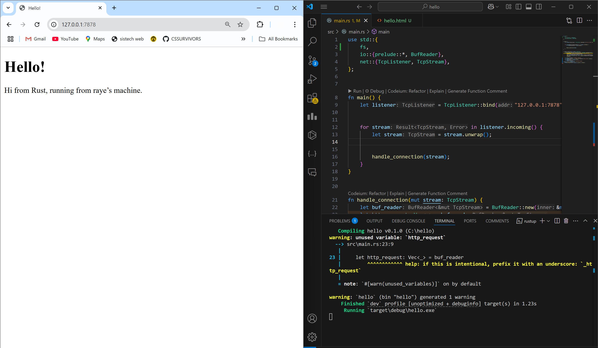
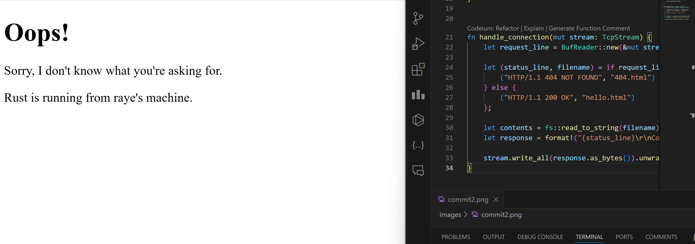
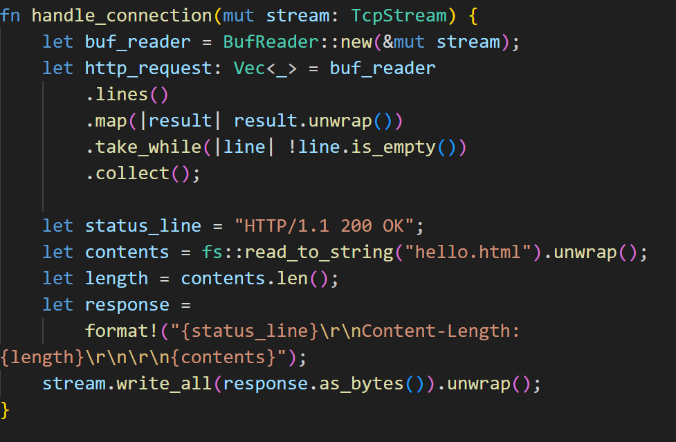
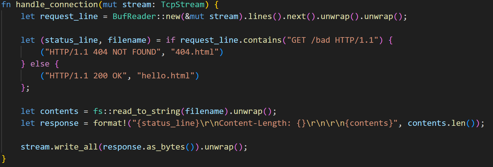

# Reflection

## Commit 1 

The code sets up a TCP listener on 127.0.0.1:7878 and forwards each incoming connection to the handle_connection function. Inside handle_connection, the TcpStream is wrapped in a BufReader, which reads incoming lines until it encounters an empty line, marking the end of the request headers. These header lines are collected into a vector and printed to the console, displaying typical HTTP request details. Since no response is sent back, a browser or other software making the connection will continue waiting until the connection times out.

## Commit 2

After the modification, the handle_connection function returns an HTML response. The HTML content is read from the hello.html file using fs::read_to_string and stored in the contents variable as a String. Additionally, the response includes a status line and a Content-Length header, which are important for indicating the connection's success or failure and for confirming the length of the response. Finally, format! is used to combine the status line, Content-Length, and the HTML body into a single string, which is then sent over the TCP connection using stream.write_all().

## Commit 3

The handle_connection function can filter incoming requests. If the request is directed to the root path, the server responds with hello.html. If the request targets any other path, the server returns 404.html.

### Before Refactoring

### After Refactoring

Before the refactoring, the code always returned a "200 OK" status with the contents of "hello.html" without checking the requested URL. In the updated version, I added an if condition that checks if the request contains "GET /bad HTTP/1.1". If the condition is true, the code returns a "404 NOT FOUND" status and serves the "404.html" file instead. Otherwise, it continues to return the "hello.html" file with a "200 OK" status. This change makes the code more flexible by handling different types of requests and returning the appropriate response.